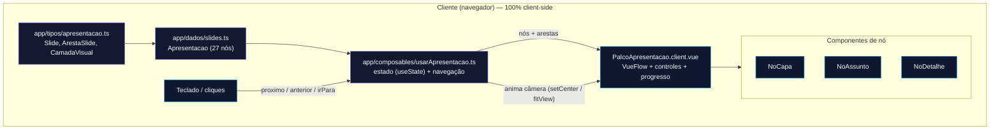

# Arquitetura da apresentação

## Visão geral

Esta apresentação é uma aplicação **Nuxt 4** que exibe os recursos do Kiro IDE
como um **infográfico animado** navegável. Em vez de slides tradicionais, cada
"slide" é um **nó (node) do Vue Flow** posicionado num grafo. A navegação move a
câmera do grafo de um nó para o outro, produzindo a sensação de uma apresentação
de slides — com a vantagem de mostrar as conexões entre os temas.

Os assuntos principais (nós do tipo `assunto`) revelam **subnós de detalhamento**
(`detalhe`) quando entram em foco, criando a metáfora de "expandir o tópico". Todo
o estado vive no cliente: **não há nenhuma chamada periódica ao servidor**
(diretriz de custo-zero).

---

## Fluxo



O diagrama resume o caminho dos dados: os **tipos** modelam a estrutura, o
arquivo de **dados** define os 27 nós/arestas, o **composable** é o motor que
mantém o estado e navega, e o **palco** renderiza tudo no Vue Flow com os
**componentes de nó** customizados. A interação (teclado/cliques) sempre passa
pelo motor, que anima a câmera localmente.

---

## Estrutura de nós e subnós

Cada slide é descrito por um objeto `Slide` (ver `app/tipos/apresentacao.ts`):

| Campo      | Descrição                                                        |
|------------|------------------------------------------------------------------|
| `id`       | Identificador único do nó.                                       |
| `titulo`   | Título exibido no cartão.                                        |
| `tipo`     | `capa` \| `agenda` \| `overview` \| `assunto` \| `detalhe`.      |
| `conteudo` | Subtítulo, descrição, tópicos, ícone e logo opcionais.           |
| `subnos`   | IDs dos detalhes revelados ao focar um `assunto`.                |
| `paiId`    | ID do assunto pai, quando o slide é um `detalhe`.                |
| `posicao`  | Coordenada `{ x, y }` do nó no palco.                            |

- **Assuntos** ficam numa faixa horizontal (`ESPACO_X = 560`).
- **Detalhes** ficam logo abaixo do pai (`y = 300`), distribuídos na horizontal.
- **Arestas** (`ArestaSlide`) ligam o fluxo principal (animadas) e cada assunto
  aos seus detalhes (reveladas só quando o assunto está em foco).

A ordem de navegação linear é a lista `ordem` da `Apresentacao`.

### Camadas visuais

O motor classifica cada nó em uma `CamadaVisual` (`abertura`, `ide`, `harness`,
`recurso`, `superficie`) a partir do `id`/`paiId`. A camada vira uma classe CSS
(`camada-ide`, etc.) que injeta a cor de destaque do cartão — dando ao
infográfico uma identidade cromática coerente sem repetir cores nos dados.

---

## Composable de navegação

`usarApresentacao()` (em `app/composables/usarApresentacao.ts`) é o motor:

- **Estado**: `useState('apresentacao-indice')` guarda o índice do slide atual.
  É estado reativo do cliente — **sem fetch, sem polling**.
- **Dados derivados**: `nos` e `arestas` (computed) convertem os `Slide` para o
  formato do Vue Flow, marcando o nó atual (`no-atual`) e esmaecendo os demais
  (`no-esmaecido`), além de aplicar a classe de camada.
- **Visibilidade dos detalhes**: `detalhesVisiveis` decide quais subnós aparecem
  (só os do assunto em foco), e as arestas assunto→detalhe são filtradas junto.
- **Navegação**: `proximo()`, `anterior()`, `irPara(id)`, `irParaIndice(n)`,
  `irParaInicio()`, `irParaFim()` e `enquadrarTudo()`.
- **Câmera**: `animarCameraPara(id)` usa `setCenter(x, y, { zoom, duration })`
  (com `fitView` como fallback) para deslizar suavemente até o nó — tudo no
  canvas, **sem tráfego de rede**.

---

## Integração Vue Flow (client-only)

O Vue Flow acessa `window`/`document`, então **não pode rodar no SSR**. A
estratégia:

- `PalcoApresentacao.client.vue` — o sufixo `.client` garante execução apenas no
  cliente.
- Em `app/pages/index.vue`, o palco fica dentro de `<ClientOnly>` com um
  `#fallback` ("Carregando apresentação...").
- Os CSS do Vue Flow são importados em `nuxt.config.ts`.
- Os tipos de nó customizados (`NoCapa`, `NoAssunto`, `NoDetalhe`) são
  registrados via `:node-types` usando `markRaw` (evita reatividade
  desnecessária).

Assim o `pnpm generate` pré-renderiza a página sem erros de SSR: o HTML estático
traz o fallback e o Vue Flow monta só no navegador.

---

## Decisões de custo-zero

A apresentação foi pensada para **centenas de usuários simultâneos** sem gerar
carga contínua no servidor:

- **Zero polling / setInterval / WebSocket / SSE / heartbeat** batendo em
  endpoints. Não há endpoints: o conteúdo é estático (`app/dados/slides.ts`).
- **Todo o estado é client-side** (`useState`), sem sincronização com servidor.
- **As animações são 100% CSS/canvas**: transições dos cartões, revelação dos
  subnós, flutuação do fantasminha e o pan/zoom da câmera do Vue Flow. Nenhuma
  delas gera requisições.
- **Acessibilidade**: o CSS respeita `prefers-reduced-motion: reduce`,
  desligando/encurtando animações para quem preferir menos movimento.

---

## Mapa de arquivos

```
app/
├─ app.vue                              # UApp (contexto do Nuxt UI)
├─ pages/index.vue                      # <ClientOnly> + Palco
├─ components/
│  ├─ PalcoApresentacao.client.vue      # VueFlow, controles, progresso, teclado
│  └─ nos/
│     ├─ NoCapa.client.vue              # capa / agenda / overview
│     ├─ NoAssunto.client.vue           # assunto (renderiza tópicos também)
│     └─ NoDetalhe.client.vue           # detalhe (subnó)
├─ composables/usarApresentacao.ts      # motor de navegação (estado + câmera)
├─ dados/slides.ts                      # conteúdo (27 nós + arestas)
├─ tipos/apresentacao.ts                # modelo de dados
└─ assets/css/main.css                  # tema, paleta por camada, reduced-motion
public/kiro-fantasminha.svg             # marca visual da capa
```
