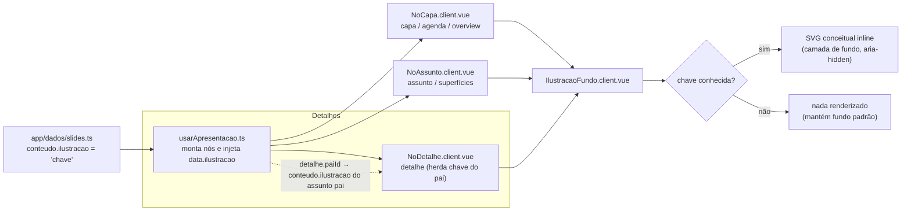

# Ilustrações de fundo ("big image") por slide

Cada nó/slide da apresentação exibe, **atrás do texto**, uma ilustração conceitual que
"desenha" a ideia do slide de forma didática — a ponto de, só pela imagem de fundo, uma
criança conseguir intuir do que trata aquele card. As ilustrações são SVG **inline e
estáticos** (nenhuma chamada de rede em runtime — steering CUSTO-ZERO), posicionados como
uma camada absoluta atrás do conteúdo, com overlay de contraste para preservar a leitura.

O mecanismo é um mapeamento por **chave estável**: cada slide declara uma string em
`conteudo.ilustracao`; um único componente (`IlustracaoFundo`) resolve essa chave para o
SVG correto. Chave ausente ou desconhecida = nenhum desenho (degradação graciosa).

## Fluxo

## Como funciona o mapeamento

1. **Declaração** — em `app/dados/slides.ts`, cada slide principal preenche
   `conteudo.ilustracao` com uma chave estável (ex.: `'motor-loop'`). O campo é opcional
   (`ilustracao?: string` em `app/tipos/apresentacao.ts`).
2. **Injeção** — o motor `app/composables/usarApresentacao.ts` monta os nós do Vue Flow e
   coloca a chave em `data.ilustracao` de cada nó. Para nós de **detalhe** a chave é
   **herdada do assunto pai** (ver seção "Detalhes").
3. **Resolução** — o componente `app/components/IlustracaoFundo.client.vue` recebe a chave
   e a camada visual; se a chave estiver no conjunto `CHAVES_CONHECIDAS`, renderiza o SVG
   correspondente. Caso contrário, não renderiza nada.
4. **Renderização** — `NoCapa`, `NoAssunto` e `NoDetalhe` inserem `<IlustracaoFundo>` como
   primeiro filho do cartão. O cartão tem `position: relative; overflow: hidden;` (as bordas
   arredondadas recortam o desenho) e o texto fica numa `.cartao-conteudo` com `z-index`
   acima da ilustração.

## Como adicionar uma nova ilustração

1. Escolha uma **chave** curta e descritiva em `kebab-case`, coerente com a metáfora
   (ex.: `'plugue-servidores'`).
2. Em `IlustracaoFundo.client.vue`:
   - adicione a chave ao `Set` **`CHAVES_CONHECIDAS`**;
   - adicione um bloco `<template v-else-if="chave === 'sua-chave'"> … </template>` com o SVG
     dentro do `<svg viewBox="0 0 400 300">`. Reutilize as classes utilitárias já existentes
     (`cheio`, `borda`, `linha`, `rotulo`, etc.) para herdar a paleta da camada via
     `var(--cor)` / `var(--cor-forte)`.
3. Em `app/dados/slides.ts`, defina `conteudo.ilustracao: 'sua-chave'` no slide desejado.
4. Rótulos de texto dentro do desenho devem ser **curtos e em pt-BR**.
5. Mantenha o SVG **leve** (poucas formas, sem imagens rasterizadas, sem fontes embutidas).
6. Se adicionar **animação**, ela deve ser puramente estética e **desligada** sob
   `@media (prefers-reduced-motion: reduce)` (ver seção "Acessibilidade").

## Lista de chaves e suas metáforas

| Chave | Slide(s) | Metáfora ("desenho" da ideia) |
|---|---|---|
| `fantasminha-portas` | capa, encerramento | Fantasminha do Kiro com várias portas/superfícies convergindo ao agente |
| `trilha-paradas` | agenda | Trilha com paradas numeradas 1→5 (o roteiro da apresentação) |
| `agente-portas` | overview, superfícies | Agente central e 5 portas (IDE/CLI/Web/Mobile/Crew) |
| `editor-robo` | Kiro IDE | Janela de editor com cursor piscando + robôzinho ao lado |
| `base-tijolos` | IDE — história | Base de tijolos (VS Code) com um robô surgindo em cima |
| `chips-cerebros` | IDE — modelos | Vários chips/modelos lado a lado, com "Auto" destacado |
| `velocimetro` | IDE — reasoning effort | Velocímetro do esforço, de "baixo" a "máx" |
| `motor-loop` | harness — conceito | Engrenagem central + loop contexto→plano→ferramenta→resultado |
| `motor-portas` | harness do Kiro | Motor central ligado por cabos às portas (IDE/CLI/Web/Mobile) |
| `casinha-usuario` | `.kiro` global (`~/`) | Casinha `~/.kiro` do usuário ligada a vários projetos |
| `pasta-git` | `.kiro` por projeto | Pasta `.kiro` dentro do repositório git do time |
| `tres-documentos` | Specs | Três documentos em sequência: requisitos→design→tarefas |
| `bussola` | Steering | Bússola/leme guiando a direção |
| `raio-engrenagem` | Hooks | Raio (gatilho/evento) disparando uma engrenagem (ação) |
| `plugue-servidores` | MCP | Plugue/cabo conectando o agente a servidores |
| `mochila-instrucoes` | Skills | Mochila de instruções (`SKILL.md`) abrindo sob demanda |
| `plugue-faisca` | Powers | Plugue com faísca ligando MCP + conhecimento |
| `linha-tempo-rewind` | Checkpoints | Linha do tempo com ponto "salvo" e seta de rewind |
| `escudo-semaforo` | Permissions | Escudo/cadeado + semáforo deny→ask→allow |
| `robos-especialistas` | Custom Agents | Agente + sub-agentes especializados ramificando |
| `simbolos-linguagens` | IDE — linguagens | Símbolos TS/Py/Jv sob um "chapéu" do agente |
| `terminal` | Superfície CLI | Janela de terminal com prompt |
| `navegador-pr` | Superfície Web | Navegador entregando um pull request |
| `celular-sessao` | Superfície Mobile | Celular com uma sessão do agente |
| `equipe-robos` | Superfície Crew | Equipe de robôs rodando no seu hardware |

> Observação: `capa`/`encerramento` reutilizam `fantasminha-portas` e `overview`/`superfícies`
> reutilizam `agente-portas` — a mesma chave pode servir a mais de um slide quando a metáfora
> é a mesma.

## Tratamento dos nós de detalhe (herança do pai)

Os subnós de **detalhe** (cartões menores, 228px) não têm chave própria. Em vez de inventar
dezenas de desenhos novos — que ficariam ilegíveis nesse tamanho e poluiriam o card —, o
detalhe **herda a ilustração do assunto pai**. A decisão foi por essa opção por ser a mais
limpa e coerente: o detalhe "pertence" ao assunto, então repetir a mesma marca conceitual, de
forma bem apagada, reforça visualmente esse vínculo sem custo de manutenção adicional.

A resolução acontece no composable `usarApresentacao.ts`: ao montar um nó de detalhe, ele
busca o assunto pai por `paiId` no mapa de slides e copia o `conteudo.ilustracao` do pai para
`data.ilustracao` do detalhe. O `NoDetalhe.client.vue` renderiza a mesma `<IlustracaoFundo>`,
porém **ainda mais esmaecida** que nos cartões maiores:

- opacidade do SVG reduzida (`0.08` no detalhe, contra `0.16` nos cartões principais);
- overlay escuro reforçado, garantindo que o texto do detalhe nunca compita com o desenho.

Se o assunto pai não tiver ilustração, o detalhe simplesmente fica sem fundo (degradação
graciosa).

## Preservação da legibilidade

Três camadas garantem que o texto sempre venha em primeiro plano:

1. **Recorte** — o cartão usa `overflow: hidden` + `border-radius`, então o SVG absoluto
   (`inset: 0`) respeita os cantos arredondados.
2. **Overlay de contraste** — um gradiente radial escuro por cima do desenho cria um "poço"
   de contraste central; nos detalhes esse overlay é ainda mais forte.
3. **Ordem de empilhamento** — o desenho fica em `z-index` baixo; o conteúdo textual vive numa
   `.cartao-conteudo` com `z-index` acima. A ilustração também é `pointer-events: none` e
   `aria-hidden="true"` (não captura clique nem é lida por leitores de tela).

## Acessibilidade (prefers-reduced-motion)

Algumas ilustrações têm animações **sutis e puramente estéticas** (engrenagem girando, agulha
oscilando, cursor piscando, ponto pulsando). Todas são definidas dentro de
`IlustracaoFundo.client.vue` e **desativadas** sob `@media (prefers-reduced-motion: reduce)`.
Como os detalhes reutilizam o mesmo componente, eles herdam automaticamente esse tratamento.
A leitura da metáfora **nunca depende de movimento**: com as animações desligadas, o desenho
continua completo e compreensível.
