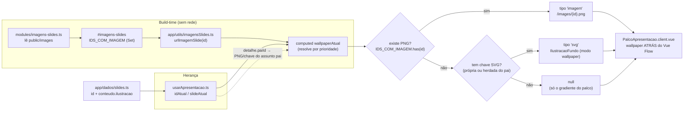

# Wallpaper do palco ("big image") por slide

A **"big image"** de cada slide deixou de morar dentro do card e passou a ser o **wallpaper
(plano de fundo) do palco**, renderizado **atrás do Vue Flow** e acompanhando o slide em foco.
O cartão (nó) volta a ser puro texto/infográfico em primeiro plano; a imagem que "desenha" a
ideia do slide fica no ambiente, ocupando a tela inteira.

A resolução do wallpaper segue uma **prioridade por id de slide**, sem nenhuma chamada de rede
em runtime (steering CUSTO-ZERO):

1. **PNG** em `public/images/{id}.png`, servido por URL (`/images/{id}.png`), quando existir.
2. **SVG conceitual** (fallback) resolvido pela chave `conteudo.ilustracao` do slide, via o
   componente `IlustracaoFundo` no modo `wallpaper`.

A existência do PNG é determinada em **build-time** (nunca por `fetch`/`HEAD` em runtime): o
módulo local `modules/imagens-slides.ts` lê `public/images` durante o build e injeta o módulo
virtual `#imagens-slides` com o conjunto `IDS_COM_IMAGEM`. Um PNG novo "passa a valer" apenas
por ser adicionado à pasta e rebuildado.

## Fluxo

## Como funciona a resolução

1. **Declaração** — em `app/dados/slides.ts`, cada slide tem um `id` estável e, opcionalmente,
   uma chave em `conteudo.ilustracao` (ex.: `'motor-loop'`). O campo é opcional
   (`ilustracao?: string` em `app/tipos/apresentacao.ts`) e **permanece** sendo a fonte da
   chave do SVG de fallback.
2. **Existência do PNG (build-time)** — o módulo `modules/imagens-slides.ts` lê os arquivos de
   `public/images` uma única vez no build e exporta `IDS_COM_IMAGEM` via o módulo virtual
   `#imagens-slides`. O utilitário `app/utils/imagensSlides.ts` reexporta esse `Set` e expõe
   `urlImagemSlide(id)` → `/images/{id}.png` quando o id tem PNG, senão `undefined`. Nenhum
   binário entra no bundle: os PNGs são servidos de `public/` por URL.
3. **Resolução do slide em foco** — o motor `app/composables/usarApresentacao.ts` expõe o
   computed **`wallpaperAtual`**, derivado de `idAtual`/`slideAtual`. Ele retorna um objeto
   discriminado: `{ tipo: 'imagem', url, camada }`, `{ tipo: 'svg', chave, camada }` ou `null`.
   A `camada` vem de `classificarCamada`, para o SVG receber `var(--cor)`/`var(--cor-forte)`.
4. **Renderização** — `app/components/PalcoApresentacao.client.vue` consome `wallpaperAtual` e
   renderiza a camada `.palco-wallpaper-camada` **atrás** do `<VueFlow>` (o wallpaper fica em
   `z-index: 0`; o fluxo em `z-index: 1`; overlays de UI acima). Imagem → elemento com
   `background-size: cover` centralizado; SVG → `<IlustracaoFundo modo="wallpaper">` em tela
   cheia. Toda a camada é `aria-hidden="true"` e `pointer-events: none` (decorativa).

## Como adicionar imagem a um slide

Há dois caminhos, na ordem de prioridade:

### 1. PNG (preferido quando existe arte pronta)

1. Coloque o arquivo em `public/images/{id}.png`, onde `{id}` é **exatamente** o
   `apresentacaoKiro.slides.id` definido em `app/dados/slides.ts`.
2. Rode o build (`CI=true pnpm build`): o módulo `imagens-slides` detecta o novo arquivo e o
   id passa a integrar `IDS_COM_IMAGEM`. Nenhuma outra alteração é necessária.

### 2. SVG conceitual (fallback quando não há PNG)

1. Escolha uma **chave** curta em `kebab-case`, coerente com a metáfora (ex.: `'motor-loop'`).
2. Em `app/components/IlustracaoFundo.client.vue`:
   - adicione a chave ao `Set` **`CHAVES_CONHECIDAS`**;
   - adicione um bloco `<template v-else-if="chave === 'sua-chave'"> … </template>` com o SVG
     dentro do `<svg viewBox="0 0 400 300">`. Reutilize as classes utilitárias já existentes
     (`cheio`, `borda`, `linha`, `rotulo`, etc.) para herdar a paleta da camada via
     `var(--cor)` / `var(--cor-forte)`.
3. Em `app/dados/slides.ts`, defina `conteudo.ilustracao: 'sua-chave'` no slide desejado.
4. Rótulos de texto dentro do desenho devem ser **curtos e em pt-BR**.
5. Mantenha o SVG **leve** (poucas formas, sem imagens rasterizadas, sem fontes embutidas).
6. Animações devem ser puramente estéticas e **desligadas** sob
   `@media (prefers-reduced-motion: reduce)` (ver "Acessibilidade").

## Lista de chaves e suas metáforas (fallback SVG)

Continua válida para os slides **sem PNG**: quando não há imagem em `public/images/{id}.png`,
o wallpaper usa o SVG conceitual identificado por estas chaves.

| Chave | Slide(s) | Metáfora ("desenho" da ideia) |
|---|---|---|
| `fantasminha-portas` | capa, encerramento | Fantasminha do Kiro com várias portas/superfícies convergindo ao agente |
| `trilha-paradas` | agenda | Trilha com paradas numeradas 1→5 (o roteiro da apresentação) |
| `agente-portas` | overview, superfícies | Agente central e 5 portas (IDE/CLI/Web/Mobile/Crew) |
| `editor-robo` | Kiro IDE | Janela de editor com cursor piscando + robôzinho ao lado |
| `base-tijolos` | IDE — história | Base de tijolos (VS Code) com um robô surgindo em cima |
| `chips-cerebros` | IDE — modelos | Vários chips/modelos lado a lado, com "Auto" destacado |
| `velocimetro` | IDE — reasoning effort | Velocímetro do esforço, de "baixo" a "máx" |
| `motor-loop` | harness — conceito | Engrenagem central + loop contexto→plano→ferramenta→resultado |
| `motor-portas` | harness do Kiro | Motor central ligado por cabos às portas (IDE/CLI/Web/Mobile) |
| `casinha-usuario` | `.kiro` global (`~/`) | Casinha `~/.kiro` do usuário ligada a vários projetos |
| `pasta-git` | `.kiro` por projeto | Pasta `.kiro` dentro do repositório git do time |
| `tres-documentos` | Specs | Três documentos em sequência: requisitos→design→tarefas |
| `bussola` | Steering | Bússola/leme guiando a direção |
| `raio-engrenagem` | Hooks | Raio (gatilho/evento) disparando uma engrenagem (ação) |
| `plugue-servidores` | MCP | Plugue/cabo conectando o agente a servidores |
| `mochila-instrucoes` | Skills | Mochila de instruções (`SKILL.md`) abrindo sob demanda |
| `plugue-faisca` | Powers | Plugue com faísca ligando MCP + conhecimento |
| `linha-tempo-rewind` | Checkpoints | Linha do tempo com ponto "salvo" e seta de rewind |
| `escudo-semaforo` | Permissions | Escudo/cadeado + semáforo deny→ask→allow |
| `robos-especialistas` | Custom Agents | Agente + sub-agentes especializados ramificando |
| `simbolos-linguagens` | IDE — linguagens | Símbolos TS/Py/Jv sob um "chapéu" do agente |
| `terminal` | Superfície CLI | Janela de terminal com prompt |
| `navegador-pr` | Superfície Web | Navegador entregando um pull request |
| `celular-sessao` | Superfície Mobile | Celular com uma sessão do agente |
| `equipe-robos` | Superfície Crew | Equipe de robôs rodando no seu hardware |

> Observação: `capa`/`encerramento` reutilizam `fantasminha-portas` e `overview`/`superfícies`
> reutilizam `agente-portas` — a mesma chave pode servir a mais de um slide quando a metáfora
> é a mesma.

## Herança do assunto pai (detalhes)

Os slides de **detalhe** (subnós) não têm chave própria e, em geral, não têm PNG próprio. O
wallpaper deles é **herdado do assunto pai**, resolvido dentro de `wallpaperAtual`:

1. PNG do próprio detalhe (`/images/{idDetalhe}.png`), se existir;
2. senão, **PNG do assunto pai** (`/images/{paiId}.png`);
3. senão, **chave SVG do assunto pai** (`conteudo.ilustracao` do pai);
4. senão, `null` (o palco fica só com o gradiente base — degradação graciosa).

Assim o detalhe "pertence" visualmente ao assunto sem exigir uma imagem nova para cada subnó.
Como o wallpaper agora vive no palco, o cartão de detalhe não desenha mais ilustração interna.

## Preservação da legibilidade (overlay no palco)

A legibilidade dos cartões é garantida **no fundo do palco**, não dentro do card:

1. **Gradiente base** — o `.palco` mantém seu gradiente escuro sob o wallpaper.
2. **Overlay de legibilidade** — `.palco-wallpaper-overlay` aplica um escurecimento
   radial + vinheta sobre o wallpaper, criando contraste para os nós em primeiro plano.
3. **Empilhamento** — o wallpaper fica em `z-index: 0`, o Vue Flow em `z-index: 1`, e a UI
   (progresso, controles) acima. A camada do wallpaper é `aria-hidden="true"` e
   `pointer-events: none` (não captura clique nem é lida por leitores de tela).

No modo `wallpaper`, o `IlustracaoFundo` **não** renderiza overlay interno (evita
escurecimento duplicado) — o contraste vem exclusivamente do overlay do palco.

## Transição na troca de slide

Ao mudar `idAtual`, o wallpaper faz um **crossfade curto** via
`<Transition name="wallpaper-fade" mode="out-in">` com `:key="chaveWallpaper"` (a chave é a
imagem/chave, não o id — detalhes que herdam a imagem do pai **não reanimam** o fundo). Sem
parallax e sem loop contínuo (custo-zero). A transição é **desativada** sob
`@media (prefers-reduced-motion: reduce)`.

## Performance

- Só o wallpaper do **slide atual** é carregado. Os PNGs são servidos de `public/` **por URL**,
  nunca embutidos no bundle.
- **Prefetch leve** apenas dos vizinhos imediatos (anterior/próximo) que tenham PNG próprio,
  via `<link rel="prefetch" as="image">` (computed reativo). Não há pré-carregamento em massa
  dos 17 PNGs; imagens maiores (ex.: `superficie-crew.png` ~1.4 MB) só são buscadas quando o
  slide entra em foco (ou como prefetch do vizinho).

## Acessibilidade (prefers-reduced-motion)

Algumas ilustrações SVG têm animações **sutis e puramente estéticas** (engrenagem girando,
agulha oscilando, cursor piscando, ponto pulsando). Todas são definidas em
`IlustracaoFundo.client.vue` e **desativadas** sob `@media (prefers-reduced-motion: reduce)`;
o crossfade do wallpaper no `PalcoApresentacao.client.vue` também é desligado nessa condição.
A leitura da metáfora **nunca depende de movimento**: com as animações desligadas, o wallpaper
continua completo e compreensível. Todo o wallpaper é decorativo (`aria-hidden`), então não
introduz ruído para leitores de tela.
